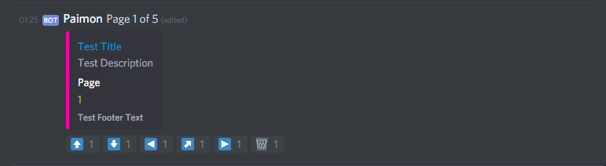

<div align="center">
<a href="https://travis-ci.org/gazmull/discord-paginationembed"></a>
</div>

# Discord.JS - Pagination Embed
A pagination utility for MessageEmbed in Discord.JS

Installing the utility: `npm install gazmull/discord-paginationembed`

Requires Discord.JS: `npm install discordjs/discord.js`

# Compatibility
Supports v12 (current master) of Discord.JS.

# Links
* [**Documentation**](https://gazmull.github.io/discord-paginationembed "Go to My Documentation")
* [**Discord.JS Documentation**](https://discord.js.org/#/docs/main/master/general/welcome "Go to Discord.JS Master Documentation")

# Examples
[In-action sample (click me)](https://github.com/gazmull/eros-bot/blob/master/src/commands/kamihime/info.ts#L177)

More examples provided at the documentation.

> ### Under `message` event

```js
const { FieldsEmbed: FieldsEmbedMode } = require('discord-paginationembed');

new FieldsEmbedMode()
  .setArray([ { name: 'John Doe' }, { name: 'Jane Doe' } ])
  .setAuthorizedUsers([message.author.id])
  .setChannel(message.channel)
  .setElementsPerPage(1)
  .setPage(2)
  .showPageIndicator(false)
  .formatField('Name', i => i.name)
  .build();
```
```js
const { Embeds: EmbedsMode } = require('discord-paginationembed');
const { MessageEmbed } = require('discord.js');

const embeds = [];

for (let i = 0; i < 5; ++i)
  // You can set per MessageEmbed properties here instead of globally below
  embeds.push(new MessageEmbed().addField('Page', i + 1));

const myImage = message.author.displayAvatarURL();

new EmbedsMode()
  .setArray(embeds)
  .setAuthorizedUsers([message.author.id])
  .setChannel(message.channel)
  .showPageIndicator(true)
  .setPage(3)
  .setImage(myImage) // Methods here and below are for customising all embeds
  .setThumbnail(myImage)
  .setTitle('Test Title')
  .setDescription('Test Description')
  .setFooter('Test Footer Text')
  .setURL(myImage)
  .setColor(0xFF00AE)
  .addBlankField()
  .addField('Test Field 1', 'Test Field 1', true)
  .addField('Test Field 2', 'Test Field 2', true)
  .build();
```

## FieldsEmbed Mode


## Embeds Mode


# Contributing
* Fork this repository.
* Execute `npm install`
* Code and code and code and code and... code!
* For API changes, please make sure they're reflected at [**index.d.ts**](src/index.d.ts).
* `npm test` to verify if your additions/adjustments are following the project's codebase rules and to verify if the docs are valid.
* Please make sure that you have tested your changes very well.
  * There is a test bot script under `test` folder. To get started:
    * Copy `credentials.sample.js` to `credentials.js` and fill up your private credentials (token, test channel, etc)
    * Execute `npm run test:bot`.
* File a [Pull Request](https://github.com/gazmull/discord-paginationembed/compare)!

# License
MIT
